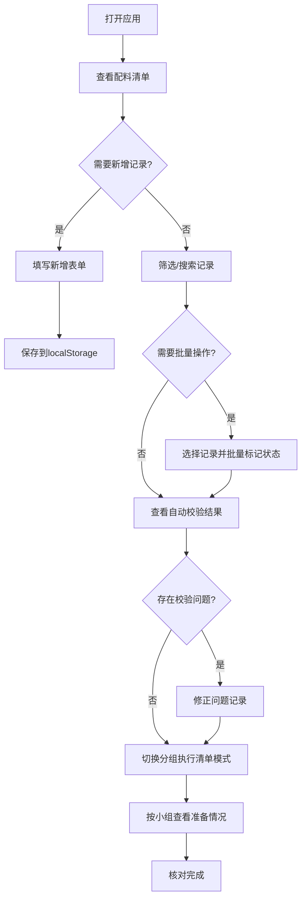

## 1. 产品概述

香囊配料清单与活动分组页，面向手作活动组织者在开场前核对布袋、填充物、绳结和小组任务。解决传统纸质清单易遗漏、难协作、缺自动校验的痛点，帮助组织者高效完成活动前准备与分组管理。

- 目标用户：手作香囊活动组织者、志愿者团队负责人
- 核心价值：数字化配料核对 + 智能校验 + 分组执行清单，减少遗漏和重复，提升活动组织效率

## 2. 核心功能

### 2.1 用户角色

| 角色 | 说明 |
|------|------|
| 活动组织者 | 管理配料清单、分配责任人、查看校验结果、生成分组执行清单 |

### 2.2 功能模块

1. **配料清单管理页**：表格化展示所有香囊配料记录，支持新增/编辑/删除，支持多维度筛选和批量状态标记
2. **分组执行清单页**：按小组汇总输出需要准备的条目、数量缺口和提醒语

### 2.3 页面详情

| 页面名称 | 模块名称 | 功能描述 |
|----------|----------|----------|
| 配料清单管理页 | 顶部筛选栏 | 按款式、难度、责任人、状态、小组五个维度筛选 |
| 配料清单管理页 | 配料记录表格 | 展示所有记录，每行含复选框，支持全选/反选 |
| 配料清单管理页 | 批量操作栏 | 选中记录后可批量标记"待准备""可分发""需补料""改为演示" |
| 配料清单管理页 | 新增/编辑弹窗 | 填写香囊款式、材料包编号、适合人数、难度、预计时长、示范要点、缺料说明、责任人、状态、所属小组 |
| 配料清单管理页 | 自动校验提示 | 实时显示同组难度过高、编号重复、责任人空缺、时长累计过长、缺料说明为空等警告 |
| 分组执行清单页 | 小组卡片列表 | 按小组展示需要准备的条目、数量统计、缺口提醒 |
| 分组执行清单页 | 提醒语生成 | 自动生成每个小组的注意事项和缺料提醒 |

## 3. 核心流程

用户打开页面 → 查看/新增配料记录 → 通过筛选定位特定记录 → 批量标记状态 → 系统自动校验并提示问题 → 切换到分组执行清单模式 → 按小组核对准备情况 → 导出或打印执行清单

## 4. 用户界面设计

### 4.1 设计风格

- 主色调：暖棕色系（#8B6F47），搭配米白色背景（#FDF8F0），呼应香囊传统手作质感
- 辅助色：深棕（#5C4033）用于标题，朱砂红（#C75450）用于警告/缺料，翠绿（#5B8C5A）用于完成/可分发
- 按钮风格：圆角微阴影，主按钮实色填充，次按钮描边
- 字体：标题使用衬线体风格，正文使用清晰无衬线体
- 布局：顶部导航 + 筛选栏 + 主内容区，卡片式分组展示
- 图标风格：线性图标，与手作主题呼应

### 4.2 页面设计概览

| 页面名称 | 模块名称 | UI元素 |
|----------|----------|--------|
| 配料清单管理页 | 顶部导航 | 应用标题、模式切换按钮（清单/分组执行） |
| 配料清单管理页 | 筛选栏 | 五个下拉筛选器横排，重置按钮 |
| 配料清单管理页 | 批量操作栏 | 选中计数、四个状态按钮、删除按钮 |
| 配料清单管理页 | 记录表格 | 斑马纹行、状态标签彩色、行内编辑按钮 |
| 配料清单管理页 | 校验提示面板 | 固定底部或侧边，按类型分类显示警告 |
| 配料清单管理页 | 新增/编辑弹窗 | 居中模态框，表单分组排列 |
| 分组执行清单页 | 小组卡片 | 每组一张卡片，含条目列表、统计数字、提醒语 |

### 4.3 响应式设计

- 桌面优先设计，表格在宽屏完整展示
- 平板端筛选栏折叠为下拉面板
- 移动端表格改为卡片列表，弹窗改为全屏表单

### 4.4 3D场景指引

不适用
