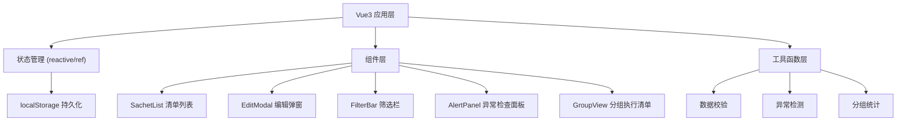
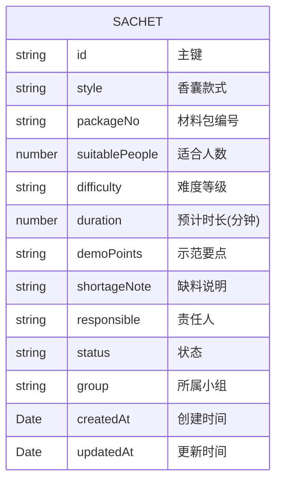

## 1. 架构设计

纯前端单页应用，所有数据保存在浏览器 localStorage 中，无需后端服务。



## 2. 技术描述

- 前端框架：Vue 3 + TypeScript + Vite
- 样式方案：Tailwind CSS 3
- 状态管理：Vue Composition API (reactive/ref)
- 数据持久化：localStorage
- 图标库：lucide-vue-next
- 初始化工具：vite-init

## 3. 路由定义

| 路由 | 用途 |
|------|------|
| / | 主页面（配料清单 + 分组清单视图切换） |

本应用为单页应用，通过视图切换而非路由切换来展示不同模式。

## 4. 数据模型

### 4.1 数据模型定义



### 4.2 枚举值定义

- **难度等级**: `入门` | `简单` | `中等` | `较难` | `进阶`
- **状态**: `待准备` | `可分发` | `需补料` | `改为演示`
- **小组**: 由用户自定义输入

### 4.3 异常检测规则

1. **同一小组难度过高**：小组内包含 `较难` 或 `进阶` 难度的材料包数量超过 2 个
2. **材料包编号重复**：存在相同 `packageNo` 的记录
3. **责任人空缺**：`responsible` 字段为空
4. **预计时长累计过长**：同一小组所有材料包时长累计超过 180 分钟
5. **缺料说明为空**：状态为 `需补料` 但 `shortageNote` 为空

## 5. 项目结构

```
src/
├── components/          # 组件目录
│   ├── SachetCard.vue      # 材料包卡片
│   ├── EditModal.vue       # 新增/编辑弹窗
│   ├── FilterBar.vue       # 筛选栏
│   ├── AlertPanel.vue      # 异常检查面板
│   ├── GroupCard.vue       # 分组卡片
│   └── BatchToolbar.vue    # 批量操作栏
├── composables/         # 组合式函数
│   ├── useSachetData.ts    # 材料包数据管理
│   └── useAlertCheck.ts    # 异常检测逻辑
├── types/               # 类型定义
│   └── sachet.ts           # 材料包相关类型
├── utils/               # 工具函数
│   └── storage.ts          # localStorage 封装
├── views/               # 页面视图
│   └── HomeView.vue        # 主页
├── App.vue              # 根组件
└── main.ts              # 入口文件
```

## 6. 状态管理设计

使用 Vue 3 Composition API 的 reactive/ref 进行状态管理：

- `sachetList`: 材料包列表
- `filters`: 当前筛选条件
- `selectedIds`: 批量选中的 ID 列表
- `viewMode`: 当前视图模式（list | group）
- `alertList`: 异常检测结果列表

状态变更通过 watch 自动同步到 localStorage。
