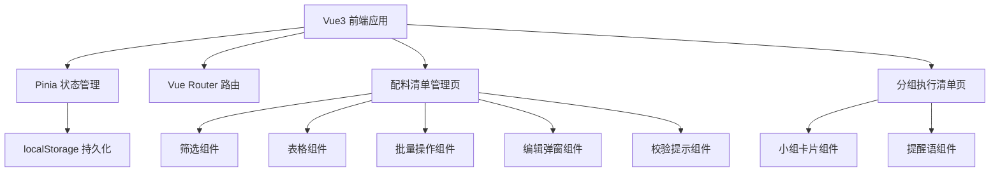
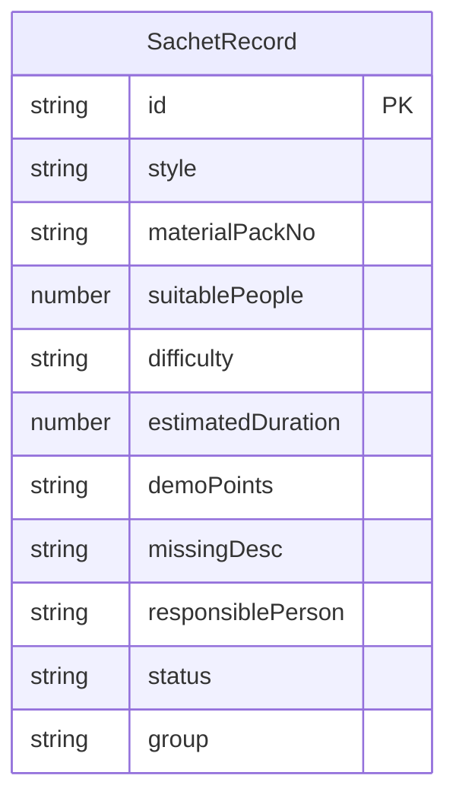

## 1. 架构设计



## 2. 技术说明

- 前端：Vue3 + TypeScript + Tailwind CSS + Vite
- 初始化工具：vite-init (vue-ts 模板)
- 状态管理：Pinia（Vue3 官方推荐）
- 路由：Vue Router 4
- 后端：无（纯前端）
- 数据库：localStorage

## 3. 路由定义

| 路由 | 用途 |
|------|------|
| / | 配料清单管理主页（含筛选、表格、批量操作、校验） |
| /group-checklist | 分组执行清单页面（按小组输出准备条目和提醒） |

## 4. API定义

无后端API，所有数据通过 Pinia Store + localStorage 管理。

### 4.1 核心数据类型

```typescript
type Status = '待准备' | '可分发' | '需补料' | '改为演示'
type Difficulty = '简单' | '中等' | '困难'

interface SachetRecord {
  id: string
  style: string
  materialPackNo: string
  suitablePeople: number
  difficulty: Difficulty
  estimatedDuration: number
  demoPoints: string
  missingDesc: string
  responsiblePerson: string
  status: Status
  group: string
}

interface ValidationIssue {
  type: 'difficulty_too_high' | 'duplicate_pack_no' | 'no_responsible' | 'duration_too_long' | 'missing_desc_empty'
  recordIds: string[]
  message: string
}

interface GroupChecklist {
  groupName: string
  items: SachetRecord[]
  totalDuration: number
  shortageCount: number
  reminders: string[]
}
```

## 5. 服务器架构图

不适用（纯前端项目）

## 6. 数据模型

### 6.1 数据模型定义



### 6.2 数据定义语言

使用 localStorage 键值对存储：
- `sachet-records`：JSON 序列化的 SachetRecord 数组
- `sachet-groups`：JSON 序列化的小组名称数组

### 6.3 校验规则

| 校验类型 | 规则 | 提示信息 |
|----------|------|----------|
| 难度过高 | 同一小组内存在"困难"级别记录 | "第X组包含困难级别项目，请确认是否有足够指导人员" |
| 编号重复 | 材料包编号在全局重复 | "材料包编号XXX存在重复" |
| 责任人空缺 | 责任人字段为空 | "存在未分配责任人的记录" |
| 时长累计过长 | 同一小组预计时长累计超过120分钟 | "第X组累计时长超过120分钟，建议拆分" |
| 缺料说明为空 | 状态为"需补料"但缺料说明为空 | "状态为需补料但未填写缺料说明" |
